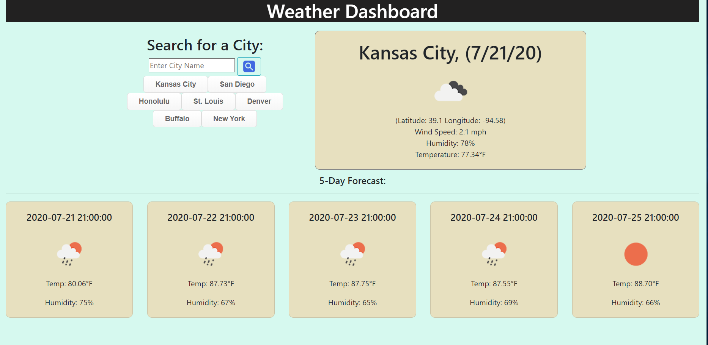

# WeatherApp
Weather App

For this assignment I was tasked to create a Weather Dashboard utilizing an API to query the current weather of a user defined city, and it's 5 day forcast.

The user can choose to either search for a new city or choose from an array of buttons labelled with city names.
If the desired city is not among the buttons, the user may enter a new city and hit the search button. 
If the city does not already exist within previously searched cities, a button is added for the new city.
To bring up the weather for any of the previously searched cities the user may click on the generated button. 
The UV index is displayed inside the current weather portion and elevated UV indexes are highlighted according to their level.

Follow the following link to see the deployed application: https://ubern00bie.github.io/WeatherApp/

