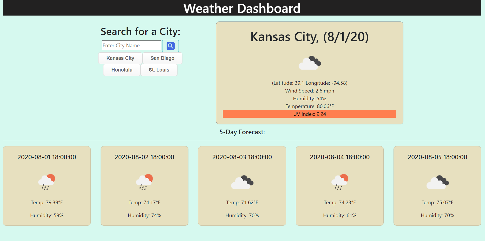

# WeatherApp
Weather App

Technologies used: HTML, CSS, JavaScript, jQuery

For this assignment I was tasked to create a Weather Dashboard utilizing an API to query the current weather of a user defined city, and it's 5 day forcast.

The user can choose to either search for a new city or choose from an array of buttons labelled with city names.
If the desired city is not among the buttons, the user may enter a new city and hit the search button. 
If the city does not already exist within previously searched cities, a button is added for the new city.
To bring up the weather for any of the previously searched cities the user may click on the generated button. 
The UV index is displayed inside the current weather portion and elevated UV indexes are highlighted according to their level.

Follow the following link to see the deployed application: https://ubern00bie.github.io/WeatherApp/

Contact info: jbenningfield.dev@gmail.com

## License
 
The MIT License (MIT)

Copyright (c) 2015 Chris Kibble

Permission is hereby granted, free of charge, to any person obtaining a copy of this software and associated documentation files (the "Software"), to deal in the Software without restriction, including without limitation the rights to use, copy, modify, merge, publish, distribute, sublicense, and/or sell copies of the Software, and to permit persons to whom the Software is furnished to do so, subject to the following conditions:

The above copyright notice and this permission notice shall be included in all copies or substantial portions of the Software.

THE SOFTWARE IS PROVIDED "AS IS", WITHOUT WARRANTY OF ANY KIND, EXPRESS OR IMPLIED, INCLUDING BUT NOT LIMITED TO THE WARRANTIES OF MERCHANTABILITY, FITNESS FOR A PARTICULAR PURPOSE AND NONINFRINGEMENT. IN NO EVENT SHALL THE AUTHORS OR COPYRIGHT HOLDERS BE LIABLE FOR ANY CLAIM, DAMAGES OR OTHER LIABILITY, WHETHER IN AN ACTION OF CONTRACT, TORT OR OTHERWISE, ARISING FROM, OUT OF OR IN CONNECTION WITH THE SOFTWARE OR THE USE OR OTHER DEALINGS IN THE SOFTWARE.